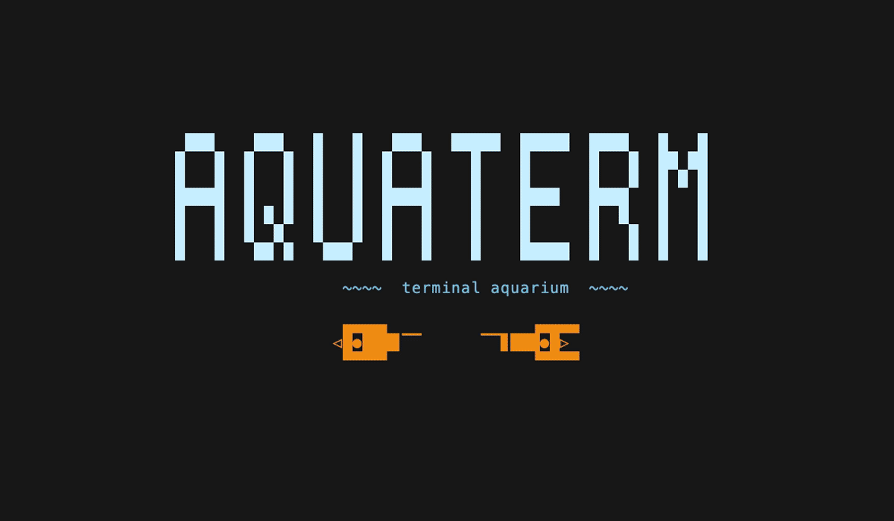
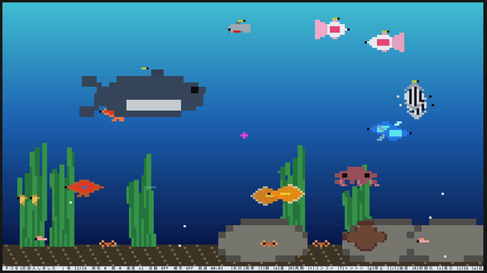

# aquaterm

A living aquarium ecosystem in your terminal.

餌を与え、魚を育て、繁殖や捕食、世代交代を眺める Rust 製のターミナルアクアリウムです。



<details>
<summary>aquaterm logo</summary>

```
 ███    ███   █   █   ███   █████  █████  ████   █   █
█   █  █   █  █   █  █   █    █    █      █   █  ██ ██
█   █  █   █  █   █  █   █    █    █      █   █  █ █ █
█████  █   █  █   █  █████    █    ████   ████   █   █
█   █  █ █ █  █   █  █   █    █    █      █  █   █   █
█   █  █  █   █   █  █   █    █    █      █   █  █   █
█   █   ██ █   ███   █   █    █    █████  █   █  █   █

        ~~~~  terminal aquarium  ~~~~

   ▄▄▄▄▖              ▗▄▄▄▄
 ◁█●███▊▔▔      ▔▔▊███●█▷
   ▀▀▀▀▘              ▝▀▀▀▀
```

</details>



## Quick start

```sh
git clone git@github.com:vJ39/aquaterm.git
cd aquaterm
cargo run --release
```

音無しでビルドしたい場合(Linux向けクロスコンパイル等でALSAが無い環境向け):

```sh
cargo run --release --no-default-features
```

## Highlights

- 餌を与え、成長・繁殖・世代交代を眺める生態系シミュレーション
- ピラニアやタコによる捕食と、藻や岩に隠れて逃げる魚たち
- 餌や薬の投下、ガラスを叩く・魚を呼び寄せるインタラクション
- 実時刻に連動する昼夜照明と、時々現れるカメオ生物(ウミガメ・クラゲ・魚群)
- ratatui を使わない自前ハーフブロック・差分レンダリング
- 終了時に状態を保存し、次回起動時に続きから再開
- 複数の水槽を名前付きで保存し、`N`キーの選択画面から切り替えられる

## Controls

| キー | 動作 |
|---|---|
| 矢印キー | カーソル(照準)を移動(`Shift`+矢印キーで高速移動) |
| `f` | カーソル位置から餌やり |
| `m` | カーソル位置から薬を投げる |
| `t` | ガラスを叩く(近くの魚が驚いて逃げる) |
| `T` | トントン(近くの魚がカーソル位置に寄ってくる) |
| `p` | 一時停止 / 再開 |
| `?` | ヘルプ(全種の図鑑つき) |
| `q` / Esc | 保存して終了 |

<details>
<summary>Advanced controls</summary>

| キー | 動作 |
|---|---|
| `[` / `]` | シミュレーション速度を下げる / 上げる |
| `R` | 水槽グレートリセット(確認あり) |
| `v` | ステータスオーバーレイの表示切替 |
| `s` | 効果音のON/OFF |
| `a` | 自動モード(自動餌やり/投薬/ガラス叩き)のON/OFF |
| `A` | 自動魚補充のON/OFF(`a`とは別トグル) |
| `+` / `-` | 魚を1匹追加(通常5種からランダム) / 間引く |
| `S` | ピラニアを1匹確実に追加(ピラニアを増やせる唯一の方法) |
| `O` | タコを1匹確実に追加(タコを増やせる唯一の方法) |
| `W` | クジラを1匹確実に追加(通常個体よりずば抜けて大きいネタ枠。捕食されず、繁殖もしない。死骸が沈み切ってから60秒後に大爆発し、水槽内の生き物を全滅させる) |
| `M` | ピラニア専用の肉餌を投下(空腹なら確実に食いつく。満腹の間は無視する。自動モードには組み込まれない) |
| `C` | 浄化剤を投下。着水した瞬間に水質を一気に浄化する。効果は着水直後が最大で10分かけて薄まり、その間は全ての魚の老化を早め、通常種の食欲を抑える(強力だが代償のある劇薬。自動モードには組み込まれない) |
| `D` | タコつぼを再配置 |
| `P` | 藻・水草を再配置 |
| `,` | 設定画面を開く(効果音/オーバーレイ/自動モード等を一覧切替。生み出す魚の種類・餌の量・カニ表示・個体数上限のトグルも含む) |
| `N` | 水槽選択画面を開く(複数の水槽を名前付きで保存・呼び出し。`↑`/`↓`で選択・`Enter`で切替(現在の水槽を保存してから読込)・`n`で新規水槽名を入力・`Esc`で閉じる) |
| `H` | 生きている全個体を即座に空腹度0にする(デバッグ用) |
| `G` | 生きている全ての稚魚を即座に成魚にする(デバッグ用) |
| `K` | 産卵可能な同種ペアを即座に交尾成立(ハート演出+卵)させる(デバッグ用) |
| `J` | 水質(pollution)を0とMAXの間でトグルする(デバッグ用) |
| `X` | 生きている個体からランダムに1匹選んで即座に死亡させる(デバッグ用) |
| `Z` | スター(無敵アイテム)をカーソル位置に確実に投入する(デバッグ用) |
| `L` | 生きている個体からランダムに1匹選び、寿命(老衰死)の残りを10秒にする(デバッグ用) |
| `B` | 存在するクジラを、沈んで着地してから60秒後の大爆発を待たずに即座に大爆発させる(デバッグ用) |

</details>

## Aquarium life

魚には空腹度、年齢、成長段階、健康状態があります。

餌を与えると成長し、成魚は卵を産みます。病気や飢餓を放置すると弱り、寿命を迎えた魚は次の世代を残して死んでいきます。

ピラニアやタコは他の魚を捕食しますが、魚は藻や岩に隠れて身を守れます。タコは追われると墨を吐いて逃げます。無敵になれるスターは自然には出現せず、`Z`キーで投入できるデバッグ用のネタ機能です。

詳しいルールやパラメータは [仕様書](docs/spec.md) を参照してください。

<details>
<summary>Platform notes (Linux / cross-compilation)</summary>

開発は主にmacOS上で行っています。音無し(`--no-default-features`)版は、Linux実機上での動作を確認済みです。

macOSから`x86_64-unknown-linux-musl`ターゲットへのクロスコンパイル(音無し)で静的リンクのLinux用ELFバイナリを生成できます:

```sh
export CC_x86_64_unknown_linux_musl=x86_64-linux-musl-gcc
export CARGO_TARGET_X86_64_UNKNOWN_LINUX_MUSL_LINKER=x86_64-linux-musl-gcc
cargo build --release --target x86_64-unknown-linux-musl --no-default-features
```

生成したバイナリをUbuntu 24.04(x86_64)の実機に転送して起動し、スプラッシュ・ヘルプ画面が正しく表示され、クラッシュしないことを確認済みです。

音あり(既定feature)でのクロスコンパイルは、クロスコンパイル環境にALSAのsysrootが無いため`alsa-sys`のビルドに失敗します(pkg-configがALSAを見つけられない)。音ありでLinux上でビルドしたい場合は、そのLinuxマシン上で直接`cargo build --release`してください。事前に以下が必要です(Debian/Ubuntu系):

```sh
sudo apt install libasound2-dev pkg-config
```

(Fedora/RHEL系では `alsa-lib-devel` 相当のパッケージ)

その他、コードレベルで確認した限りでは以下の理由からLinux上でも問題なく動くと考えられます:

- 端末描画(`crossterm`)はUnix系(Linux/macOS共通)で`termios`ベースの実装を使うクレートで、Linuxサーバーでの利用実績も多い
- オーディオ出力デバイスが無いヘッドレスサーバーでも、`SoundEngine::new()`はデバイス初期化失敗を握りつぶしてSEなしで動作を継続する
- 状態保存先(`~/.config/aquaterm/tanks/*.json`等)は`$HOME`環境変数を直接参照する自前実装で、OS固有のAPIには依存していない

</details>

## Save data

複数の水槽を名前付きで保存できます。各水槽の状態(魚・卵・餌・薬・藻・岩・タコつぼ等と経過時間、効果音/オーバーレイ/自動モード/自動魚補充/昼夜連動等の設定トグル)は `~/.config/aquaterm/tanks/<水槽名>.json` に保存され、いま開いている水槽名は `~/.config/aquaterm/current_tank.txt` に記録されます。`q` 終了時に保存し、起動時に前回開いていた水槽を読み込んで再開します(水槽が無ければ初期状態で開始)。血飛沫・墨・カメオ生物・水流の筋など一瞬〜数十秒で消える演出は保存対象外です。

水槽名にはファイルシステムで安全な文字(英数字・日本語等の文字種・`-`・`_`)だけを使えます(それ以外の文字は入力時に除去されます)。`N`キーで水槽選択画面を開き、`↑`/`↓`で選択・`Enter`で切替・`n`で新規水槽名を入力できます(詳細はControls参照)。

複数水槽化より前のバージョンで使っていた固定パスのセーブ(`~/.config/aquaterm/state.json`)がある場合は、初回起動時に自動で「default」という名前の水槽として取り込まれます(元のファイルは削除されず残ります)。

## Development

```sh
cargo test
```

370 unit tests cover:

- 空腹度・成長・病気・繁殖・寿命
- ピラニア・タコの捕食と逃走行動
- タコの墨・隠れ場所(藻/岩)による被食免除
- 自動モード・自動魚補充
- 演出・効果音イベントの発火
- 昼夜の照明変化・状態の永続化

`cargo build --release --no-default-features` で効果音(rodio)自体をビルドから切り離すこともできます。オーディオ出力デバイスが無い環境でも`cargo build`/`cargo test`は問題なく通ります。

技術的な特徴: crosstermによる自前レンダリング(ratatui非依存)。ハーフブロック文字`▀`で縦2倍解像度のカラー描画、前フレームとの差分のみ書き込みちらつきを抑制。魚はf64座標で保持しなめらかに遊泳します。

## Documentation

詳細な仕様(種ごとのパラメータ、確率、タイマー、内部実装)は [docs/spec.md](docs/spec.md) を参照してください。
